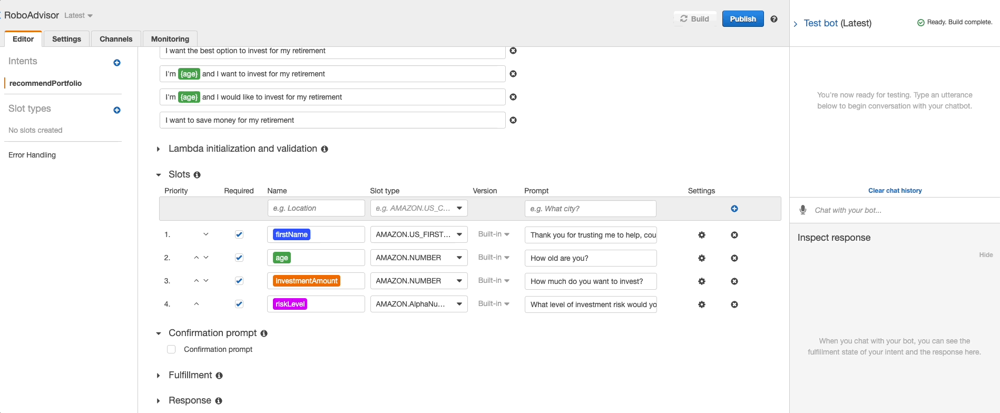
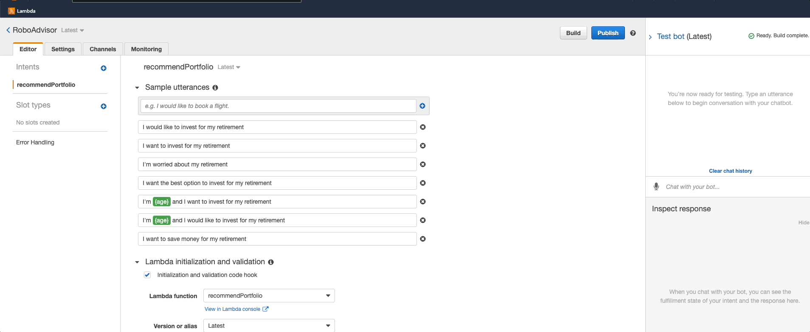

# Retirement Robo Advisor

We have created a bot that will recommend an investment portfolio for a retirement plan.

We defined an Amazon Lex bot with a single intent that establishes a conversation about requirements to suggest an investment portfolio for retirement. Then we built and tested the robo advisor making sure that the bot worked and accurately responds during the conversation with the user. Finally we enhanced the robo advisor with an Amazon Lambda functionm, creating a function that validates the user's input and returns the investment portfolio recommendation. 

## Bot test gif

The gifs below are examples of the bot functionality, the first one without the lambda function and the second one enhanced by the lambda function, which includes answers that were out of the scope of the bot. 

## Technologies

This application uses python 3.7.11 and the following packages:

* **datetime**

* **dateutil**

* **AWS Lex**

* **AWS Lambda**

## Contributors

Jaime Aranda

---

## License

Licensed under the MIT License.
